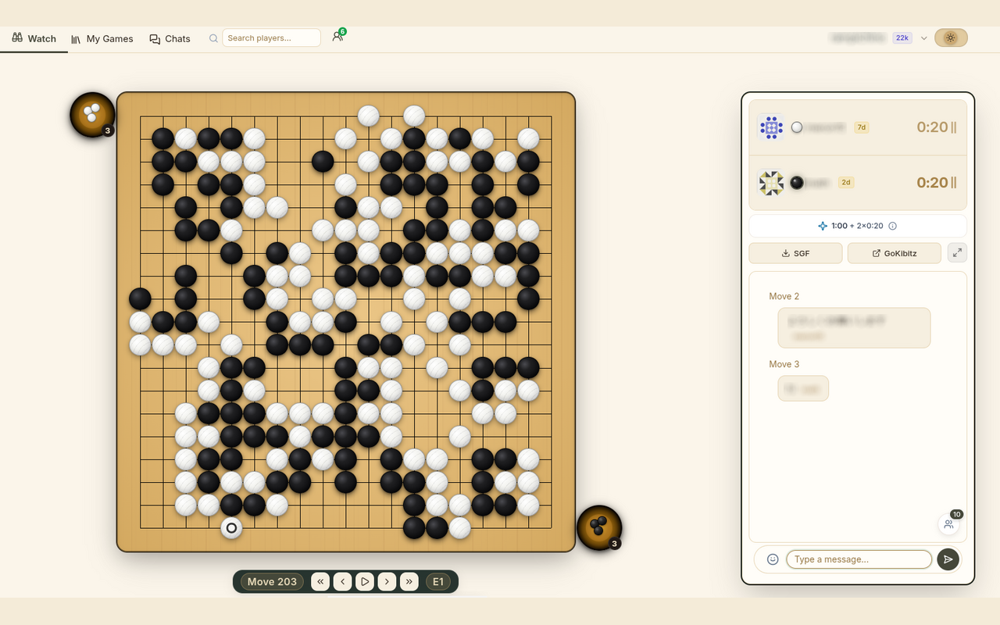
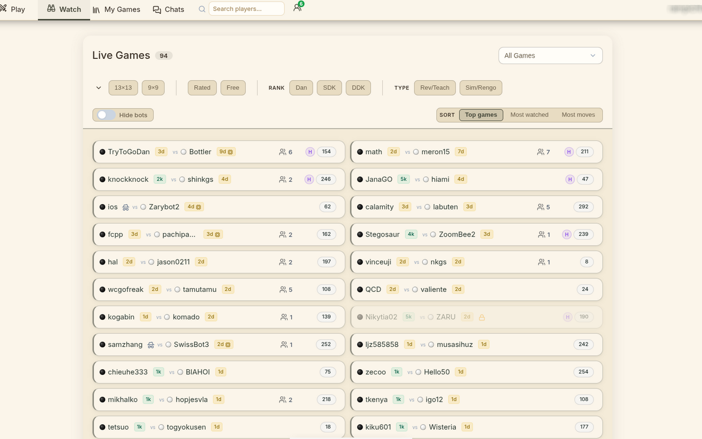
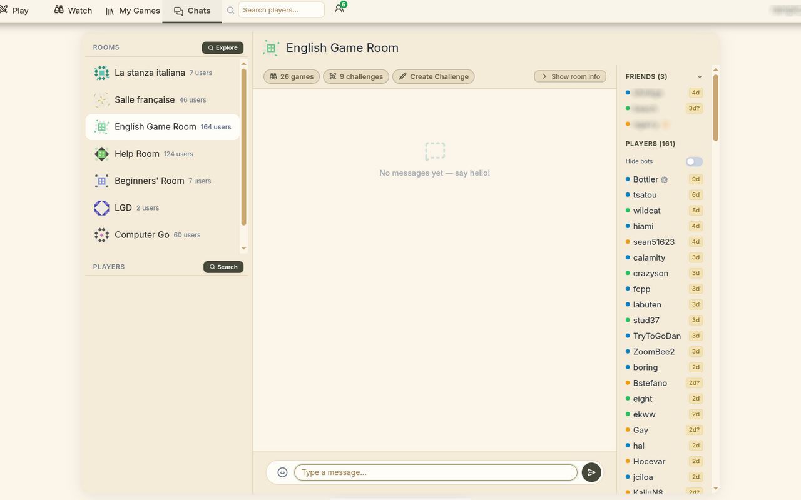
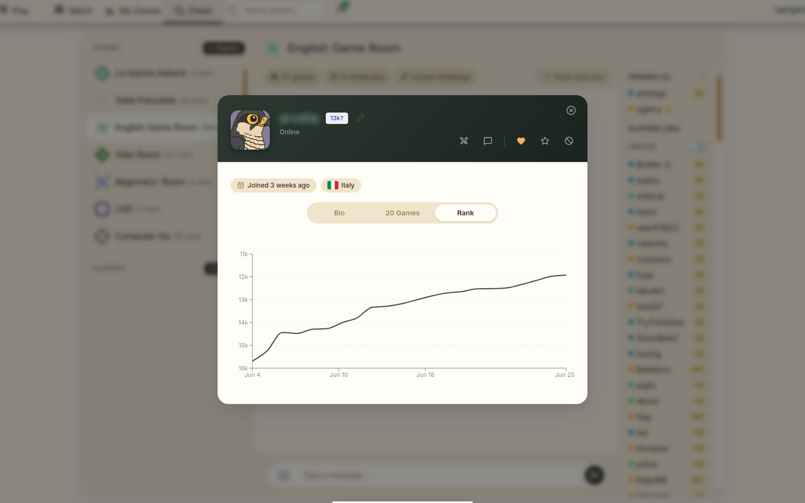
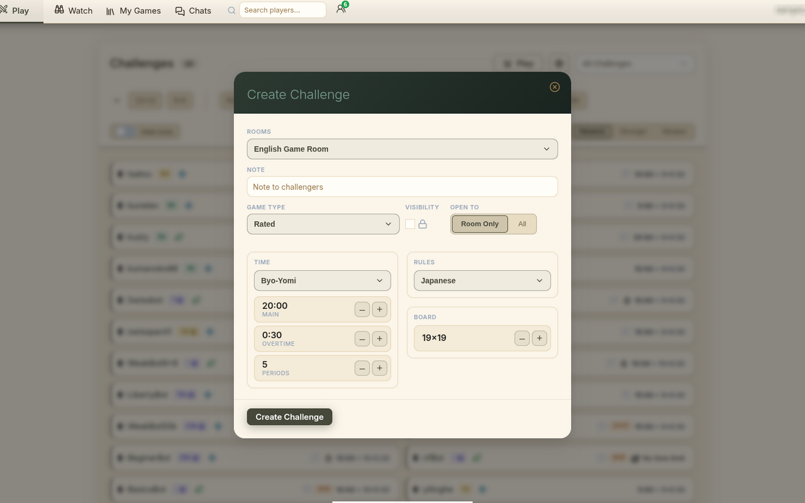
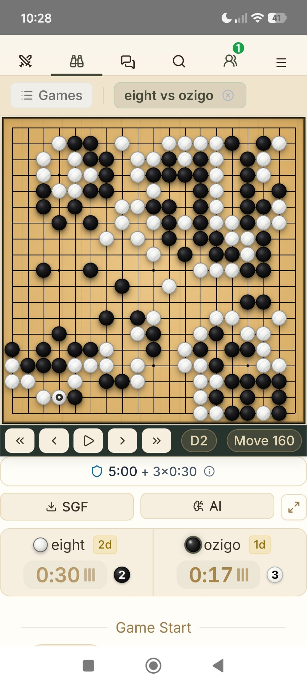

#  Kido

[](https://github.com/rampichino/kido_kgs/actions)
[](https://opensource.org/licenses/MIT)

A modern, fast, and feature-rich JavaScript web client for the **KGS Go Server** (Kiseido Go Server). Designed with rich aesthetics, responsiveness, and a first-class mobile and desktop gaming experience in mind.

---

## 🚀 Key Features

* **Modern React & UI Layout**: A streamlined visual layout designed to maximize the visible board space and provide seamless navigation on both web and mobile viewports.
* **Classic & Custom Aesthetics**:
  * **Themes**: Light, Mid (warm cream) and Dark, with a configurable accent colour.
  * **Board & stone styles**: nine board surfaces (kaya, tatami, washi, …) and seven stone sets, including flat and 3D glossy stones with curved shell-grain lines.
  * **Dynamic Avatars**: Client-side Jdenticon avatar fallbacks when custom player profile photos are unavailable.
* **Go Room & Game Interactions**:
  * Active games watch lists and lobbies.
  * Real-time game spectating, direct user messaging, and room chats.
  * In-game analysis tools with move navigation sliders, Go-to-Start/End options, and auto-play toggles.
  * Interactive Go Rank graphs built on modern SVG charts using **Recharts**.
* **Modern Tech Stack**:
  * **React 18** frontend, type-checked with **Flow**.
  * Global SCSS partials — no CSS-in-JS, no CSS Modules.
  * Ships as a Chrome extension (MV3) and an Android app (Capacitor), both talking directly to the KGS JSON API.

---

## 📸 Screenshots

| Board | Watch list | Chats |
|---|---|---|
|  |  |  |

| Player profile | Challenge | Android |
|---|---|---|
|  |  |  |

---

## 📋 Features Not Yet Implemented (Candidates for Development)

These are features supported by the KGS server protocol or planned for the UI but not yet implemented:

### High Priority (ordered)
- ⬜ **Add preselected settings for create challenges that can be stored in cache**.
- ⬜ **For the live game and challenges list add a table list version**.
- ⬜ **Add the FUN game list or make first on the list or something else to highlight them**.
- ⬜ **Allow guest login**.
- ⬜ **Game Ended**: Audio feedback and graphical icons should be implemented when the game concludes..
- ⬜ **Game time expiry**: the countdown and its urgent state exist; what's missing is handling the clock actually hitting zero (loss-on-time treatment, audio).

### Medium Priority (ordered)
- ⬜ **Audio Streaming & Commentary** [from CGoban]: Listen/stream live game commentary audio during watched matches or lessons.

### Low Priority (ordered)
- ⬜ **Tournament notifications**: Alert when tournament game is ready.
- ⬜ **Negative margins**: Check negative margins.
- ⬜ **Tournament UI**: View and join tournaments.
- ⬜ **Server announcements (sending)**: broadcasting to all channels — receiving announcements already works.
- ⬜ **User avatar upload**: Allow users to upload their own avatar.
- ⬜ **Account registration**: Create new KGS account from within the app.
- ⬜ **Game board preview** thumbnails in the game list (the CSS exists; nothing renders it yet).
- ⬜ **More keyboard shortcuts** (arrow-key move navigation and Escape-to-exit-zen already exist).

### Admins tools (ordered)
- ⬜ **Chat moderation**: Teacher/moderator chat controls.
- ⬜ **Room management**: Create/edit rooms, manage owners and access lists.
- ⬜ **Account Deletion** [from CGoban]: Trigger account deletion via the `DELETE_ACCOUNT` command.

---

## 📋 Features Candidate for Reviewing

These are existing features in Kido that show logic or mathematical discrepancies when compared to the official CGoban reference client implementation and should be reviewed:

### High Priority
- 🔍 **Handicap & Komi Scaling by Board Size**:
  - *Description*: Handicap and Komi calculation inside [challenge.js](src/model/game/challenge.js) (`getMatchupInfo`) does not consider board size (assuming standard 19x19 rules).
  - *Official client behavior*: handicap values are scaled down for smaller boards (9x9 and 13x13) proportionally to the point count, and default Komi is adjusted accordingly.
- 🔍 **Pro Ranks and Special Matchups Capping**:
  - *Description*: Rank differences are calculated simply using a linear subtraction.
  - *Official client behavior*: pro-level ranks cap rank-difference calculations differently, and reverse-handicap matches apply a scaled negative Komi.

### Medium Priority
- 🔍 **Game Time Speed Classification**:
  - *Description*: `getGameTimeSpeed` in [display.js](src/model/game/display.js) already accounts for Canadian pace and Byo-yomi periods, but not board size, and it exposes four tiers (very fast / fast / normal / slow).
  - *Official client behavior*: weights the estimate by board size and defines explicit Blitz / Ultra Blitz tiers.
- 🔍 **Validation Limits for User Submissions**:
  - *Description*: bio (1500), mailbox message (1000) and game tags are capped, but the challenge "note to challengers" and the chat input still accept arbitrary lengths.
  - *Official limits (per the KGS JSON API docs)*: challenge names 80 chars, profile biography 1500, friend notes 50, chat text 1000.

### Low Priority
- 🔍 **User Search Casing**:
  - *Description*: Sidebar user searches are case-insensitive.
  - *Official client behavior*: KGS login usernames and direct challenge note matching are strictly case-sensitive.

---

## 🛠️ Tech Stack & Architecture

* **Frontend**: React 18 (`createRoot` API), JavaScript with **Flow** types.
* **Styles**: Global SCSS partials in `src/css/`, imported once from `src/css/index.scss`.
* **Charts & Visuals**: Recharts (interactive SVG graphs) and Jdenticon.
* **State Management**: a small hand-rolled store (`src/model/AppStore.js`) with Redux-like unidirectional flow — no Redux dependency.

---

## 📦 Local Development Setup

### Prerequisites
* [Node.js](https://nodejs.org/) 20 (see `.nvmrc`; CI builds on 24)
* [NPM](https://www.npmjs.com/)
* For the Android build only: Android Studio + the Android SDK

### 1. Installation
Clone the repository and install all local dependencies:
```bash
npm install
```

### 2. Run local Development Server
Start the Webpack development server at `http://localhost:3000`:
```bash
npm start
```
*Note: the dev server proxies requests to the official KGS API (see `src/setupProxy.js`). The
Chrome extension and the Android app skip the proxy and call KGS directly.*

### 3. Verification Scripts
Verify code quality, typings, and builds using these local utility scripts:
* **Linting**: Run ESLint and Prettier checks:
  ```bash
  npm run lint
  ```
  *(To auto-fix style issues, run `npm run lint -- --fix`)*
* **Flow Checks**: Run the Flow type checker:
  ```bash
  npm run flow
  ```
* **Tests**: Run the Jest suite:
  ```bash
  npm test
  ```
* **Production Build**: Compile and minify the assets:
  ```bash
  npm run build
  ```
* **Chrome Extension Build**: Compile and package the Chrome Extension into the `/chrome-extension` directory:
  ```bash
  npm run build:extension
  ```
  *To load the extension locally in Google Chrome, navigate to `chrome://extensions/`, enable "Developer mode", click "Load unpacked", and select the `/chrome-extension` output folder.*
  *(Note for AI models: Do NOT compile or build the Chrome Extension on every change. The user will run the build manually.)*

### 4. Android Build
Sync the production build into the Capacitor Android project (then build/sign from Android Studio):
```bash
npm run build:android
```

---

## 🤝 Contributing

Contributions are very welcome! Please coordinate your work through our issues list:
* Review outstanding tasks on the [Milestones Page](https://github.com/rampichino/kido_kgs/milestones).
* Browse coordinate efforts on the [Issues Tracker](https://github.com/rampichino/kido_kgs/issues).

### Code Style Guidelines
* All file modifications must conform to Prettier and ESLint rules. 
* Keep Flow type annotations clean and comprehensive.

---

## 📚 References & Resources

* [Design Rules](DESIGN_RULES.md)
* [Development Rules](DEVELOPMENT_RULES.md)
* [KGS Protocol Reference](KGS_Protocol_Reference.md)
* [Changelog](CHANGELOG.md)
* [Android App (Capacitor) Notes](ANDROID_APP.md)

---

## ⚖️ Credits & License

* Originally derived from **[shin-kgs](https://github.com/jkk/shin-kgs)** by Justin Kramer
  (MIT). The copyright line in [LICENSE.txt](LICENSE.txt) is his; this project is a
  substantially rewritten and extended fork.
* Navigation icons by [Lucide](https://lucide.dev/) — ISC License.
* Kido is an **unofficial** third-party client. It is not affiliated with, endorsed by,
  or supported by the Kiseido Go Server.
* Code released under the **MIT License**.

---

## 🔒 Privacy & third-party services

Your KGS username and password go only to `https://www.gokgs.com`, exactly as the official
client does — see [PRIVACY.md](PRIVACY.md). Two optional features contact other hosts, and
only when you explicitly use them:

* **AI review** — sends the game's SGF to [AI Sensei](https://ai-sensei.com/) or
  [Kifubara](https://kifubara.app/) when you pick one from the AI analysis dialog.
* Game SGFs are downloaded from `files.gokgs.com`.

There is no analytics, tracking or advertising of any kind.
